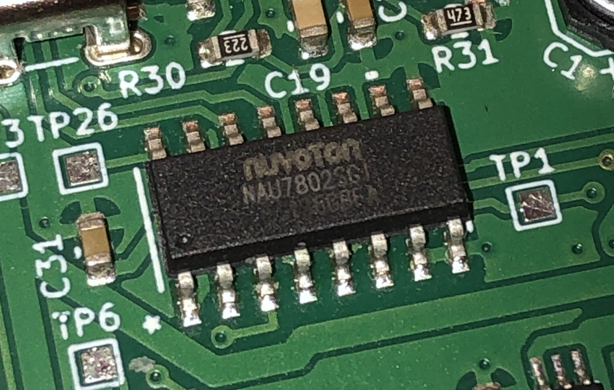

Arduino NAU7802 2CH Library
===========================================================

Forked from the [SparkFun Qwiic Scale NAU7802 Library](https://github.com/sparkfun/SparkFun_Qwiic_Scale_NAU7802_Arduino_Library).

*Disclaimer: This fork was made relatively quickly and may contain bugs.*

The NAU7802 is a 2-channel, 24-bit ADC interfaced via I2C.

This chip has gained notoriety as a load cell amplifier for use in custom scales or other sensitive measurement tasks. While this chip works perfectly well in these projects, it is equally capable of functioning as a general-purpose ADC for more basic applications (such as measuring a battery voltage or other internal analog circuits). It appears that most existing libraries overlook this fact and primarily treat it as a load cell amplifier, rather than a general-purpose ADC. Most breakout boards for the NAU7802 (like the [SparkFun](https://www.sparkfun.com/products/15242) or [Adafruit](https://www.adafruit.com/product/4538) variants) don't event expose the second channel, and are explicitly designed as load cell amplifiers. The most annoying consequence of this is that the 2nd channel is almost impossible to use, as it is often sacrificed for improving the stability of the PGA for use on the 1st channel.

This fork was created to provide a small and straightforward library for using the NAU7802 in non scale-related tasks. The changes are as follows:

- Removed the forced requirement of a filter cap on CH2, thus allowing CH2 to function
	- See function `setPGACapEnable()`
	- See Section 9.4 in datasheet
- Added function to disable (bypass) the PGA
	- See function `setBypassPGA()`
	- See Section 9.3 in datasheet
- Added function to disable the LDO & use external AVDD pin
	- Call function `setLDO(NAU7802_LDO_EXTERNAL)`
	- See Section 8.2 in datasheet
	- Inspired by [RocketEDA's Fork](https://github.com/RocketEDA/NAU7802_Arduino_externalRef)
- Added function to change LDO mode (defaults to 0)
	- See function `setLDOMode()`, param `NAU7802_LDOMODE_0` or `NAU7802_LDOMODE_1`
	- See Table 11.14 in datasheet
- Tweaked default initialization settings
	- Sampling: 10Hz
	- PGA Gain: 1x
	- PGA Cap Enable: False
- Removed all scale-specific functions
- Removed existing example sketches (most no longer work)
- Added two basic example sketches outlining usage

*A small note for anyone looking into using the NAU7802 as a general ADC: if you are only measuring positive voltages relative to ground (the use-case for most internal ADC peripherals in microcontrollers, such as the ATMEL 328p or STM32F103), then your full-scale voltage will only be HALF of your VREF. For the simplest case with REFN=0.0V & REFP=3.3V and VIN1N=0.0V, this means your measurement range for VIN1P is only from 0V to 1.65V(!). This also means you only use 12 of the 24 bits of resolution. See 8.1 and 9.2 in the datasheet for more info.*

### Future Ideas
- Add functions to toggle the internal weak & strong I2C pullups
- Add functionality to read the NAU7802's internal temperature sensor

SparkFun Attribution
-------------------

SparkFun labored with love to create this code. Feel like supporting open source hardware? 
Buy a [board](https://www.sparkfun.com/products/15242) from SparkFun!

Thanks to:

* gamix25 for fixing [signed bit error](https://github.com/sparkfun/SparkFun_Qwiic_Scale_NAU7802_Arduino_Library/pull/1)

License Information
-------------------

This product is _**open source**_! 

Please use, reuse, and modify these files as you see fit. Please maintain attribution to SparkFun Electronics and release anything derivative under the same license.

Distributed as-is; no warranty is given.

- Your friends at SparkFun.
